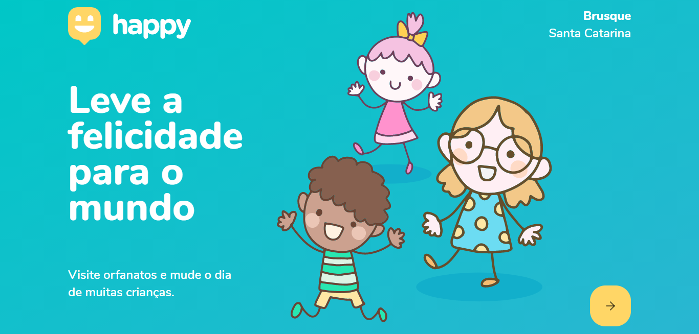
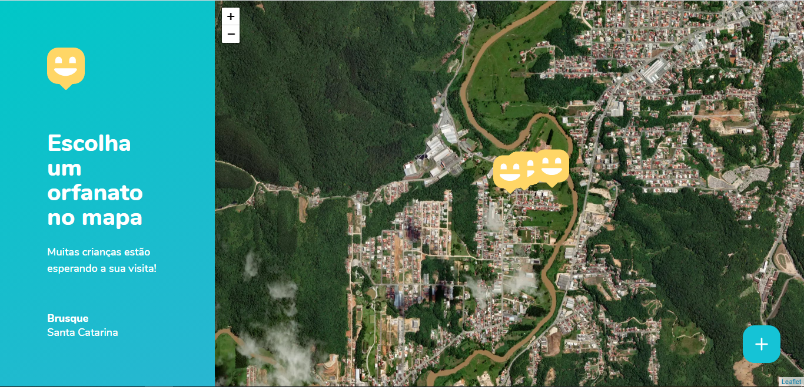
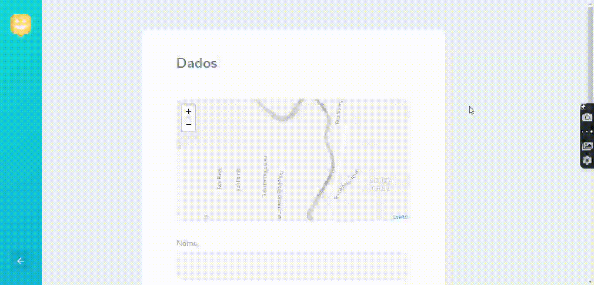
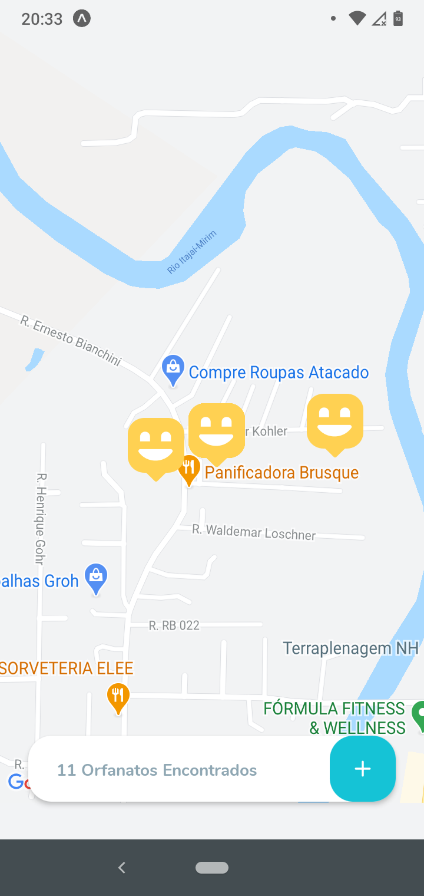
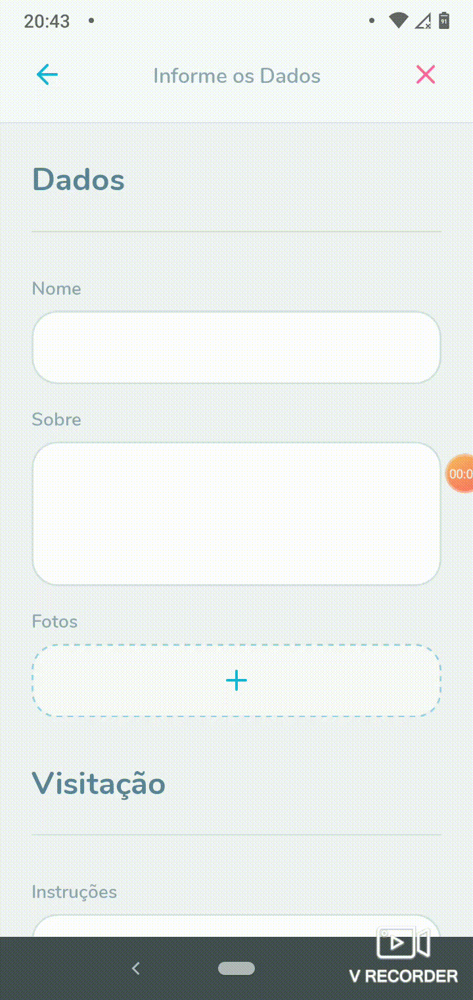

<h1 align="center">
    
    <br>Next Level Week #3<br/>
    Node.js | ReactJS | React Native
</h1>

<p align="center">
    <a href="#sobre">Sobre</a>&nbsp;&nbsp;&nbsp;|&nbsp;&nbsp;&nbsp;
    <a href="#tecnologias">Tecnologias Utilizadas</a>&nbsp;&nbsp;&nbsp;|&nbsp;&nbsp;&nbsp;
    <a href="#web">Versão Web</a>&nbsp;&nbsp;&nbsp;|&nbsp;&nbsp;&nbsp;
    <a href="#mobile">Versão Mobile</a>&nbsp;&nbsp;&nbsp;|&nbsp;&nbsp;&nbsp;
    <a href="#executar">Como Executar</a>
</p>

<p align="center">
    
<p>

<a id="sobre"></a>

# 📖 Sobre o Projeto

O **Happy** é uma aplicação Web e Mobile que possibilita aos usuários cadastrar e encontrar orfanatos. Aos usuários de visitação, é oferecido detalhes do orfanato, como horários e instruções para a visitação do orfanato.

Este projeto foi idealizado pensando no dia **12 de outubro**, onde é celebrado o **Dia das Crianças**, criado com o intuito de ajudar os usuários a encontrar orfanatos e trazer alegria as crianças.

Esta aplicação foi desenvolvida durante a **Next Level Week #3**, projeto da [Rocketseat](https://rocketseat.com.br/).

<a id="tecnologias"></a>

# ⚙ Tecnologias Utilizadas

- [Axios](https://github.com/axios/axios)
- [Express](https://expressjs.com/)
- [Expo](https://expo.io/)
- [Leaflet](https://leafletjs.com/)
- [Node.js](https://nodejs.org/en/)
- [NPM](https://www.npmjs.com/)
- [Mapbox](https://www.mapbox.com/)
- [ReactJS](https://reactjs.org/)
- [React Native](http://facebook.github.io/react-native/)
- [React Navigation](https://reactnavigation.org/)
- [Typeorm](https://typeorm.io/#/)
- [Typescript](https://www.typescriptlang.org/)
- [SQLite](https://www.sqlite.org/)
- [Yarn](https://yarnpkg.com/)

<a id="web"></a>

# 💻 Versão Web

<div align="center">
  <h3></h3>
  
  
  <h3></h3>
  
  
  <h3></h3>
  
  
  <h3></h3>
  
</div>

<a id="mobile"></a>

# 📱 Versão Mobile

<div align="center" flexDirection="row">
 
 
 
</div>

<a id="executar"></a>

# ❔ Como Usar a Aplicação

## **Pré-requisitos**

- É **necessário** possuir o **[Node.js](https://nodejs.org/en/)** instalado no computador.
- É **necessário** possuir o **[Git](https://git-scm.com/)** instalado e configurado no computador.
- É **necessário** possuir um gerenciador de pacotes, **[Yarn](https://yarnpkg.com/)** ou **[NPM](https://www.npmjs.com/)**.
- É **necessário** ter o **[Expo](https://expo.io/)** instalado de forma global na máquina.

## Passo 1: Clonando o Projeto na sua máquina:

Abra seu terminal, escolha um lugar para clonar o repositório e execute:

```sh
  git clone https://github.com/MarcosJBM/Happy-NLW-3.git
```

## Passo 2: Configurando o Projeto:

Nas pastas **Server** e **Web** execute:

```sh
 npm install
```

Com isso, dependências do projeto serão instaladas.

Na pasta **Server** voce irá precisar criar as **migrations**, execute:

```sh
 yarn typeorm migration:run
```

## Passo 3: Executando a aplicação.

Para executar a aplicação **Web** e **Mobile** utilize:

```sh
 npm start
```

Para executar o **Server**, utilize:

```sh
 npm run dev
```
